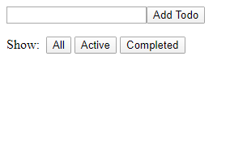
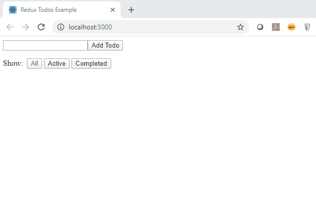

# react-redux-exercise
React Redux Exercise

This is a simple exercise to showcase the use of Redux in a React application. 

The application is a form based todo list manager. It allows the user to add todos and mark them complete. 
There are 3 filter buttons that allows the user to see either all, active, or completed todos.

The exercise is found under the "exercise" folder. The solution is also included under "solution"

## Exercise

The exercise will give you the base UI of the application as the starting point. But none of the functionality is implemented yet. 

## Solution

The end solution should look like this:

